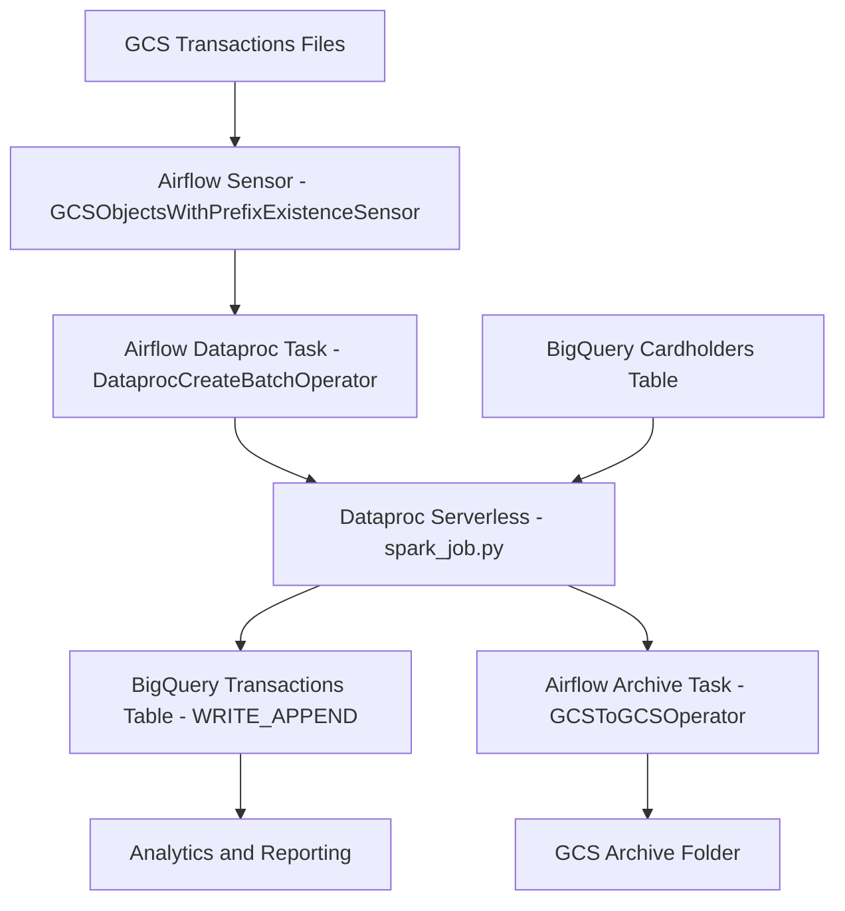

# Credit Card Transaction Analysis Pipeline

Batch data pipeline on GCP for processing credit card transactions with Airflow + Dataproc Serverless + PySpark + BigQuery.

## Overview

This project ingests JSON transaction files from Google Cloud Storage (GCS), applies validation and enrichment logic in PySpark, writes curated records to BigQuery, and archives processed source files.

Core files:
- `airflow_job.py`: Airflow DAG orchestration
- `spark_job.py`: PySpark transformation/enrichment logic
- `tests/test_transactions_processing.py`: unit tests for business rules
- `.github/workflows/ci-cd.yaml`: CI/CD workflow

## End-to-End Flow

1. Transaction files land in `gs://credit-card-data-analysis-gds/transactions/` with prefix `transactions_`.
2. Airflow sensor waits for matching files.
3. Airflow submits a Dataproc Serverless batch for `spark_job.py`.
4. Spark reads:
   - Transactions JSON from GCS
   - Cardholder master data from BigQuery table `mythic-aloe-457912-d5.credit_card.cardholders_tb`
5. Spark validates, enriches, and derives analytics columns.
6. Spark writes output to BigQuery table `mythic-aloe-457912-d5.credit_card.transactions` in append mode.
7. Airflow moves processed files from `transactions/` to `archive/`.

## Architecture Diagram (Mermaid)



## Airflow DAG Details

DAG ID: `credit_card_transactions_dataproc_dag`

Key configuration from `airflow_job.py`:
- `schedule_interval=None` (manual/externally triggered)
- `catchup=False`
- Retries: `1`, retry delay: `5 minutes`
- Start date: `2025-05-30`

Tasks:
- `check_json_file_arrival`:
  - Type: `GCSObjectsWithPrefixExistenceSensor`
  - Bucket: `credit-card-data-analysis-gds`
  - Prefix: `transactions/transactions_`
  - Timeout: `600s`
  - Poke interval: `30s`
- `run_credit_card_processing_job`:
  - Type: `DataprocCreateBatchOperator`
  - Region: `us-central1`
  - Runtime version: `2.2`
  - Project: `mythic-aloe-457912-d5`
  - Batch ID format: `credit-card-batch-<uuid8>`
- `move_files_to_archive`:
  - Type: `GCSToGCSOperator`
  - Moves from `transactions/` to `archive/`
  - Trigger rule: `ALL_SUCCESS`

Execution order:
- `check_json_file_arrival >> run_credit_card_processing_job >> move_files_to_archive`

## Spark Processing Logic

Function: `process_transactions(trans_df, cardholders_df, time_format="HH:mm:ss")`

### 1) Validation filters
Records are kept only when:
- `transaction_amount > 0`
- `transaction_status IN ("SUCCESS", "FAILED", "PENDING")`
- `cardholder_id IS NOT NULL`
- `merchant_id IS NOT NULL`

### 2) Derived columns
- `transaction_category`:
  - `Low` if `amount <= 100`
  - `Medium` if `100 < amount <= 500`
  - `High` if `amount > 500`
- `transaction_timestamp`: parsed to Spark timestamp
- `high_risk`:
  - `fraud_flag == true`, OR
  - `transaction_amount > 10000`, OR
  - `transaction_category == "High"`
- `merchant_info`: `merchant_name + " - " + merchant_location`

### 3) Enrichment
- Left join with cardholder data on `cardholder_id`

### 4) Rewards update
- `updated_reward_points = reward_points + round(transaction_amount / 10)`

### 5) Fraud risk labeling
- `Critical` if `high_risk == true`
- `High` if `risk_score > 0.3 OR fraud_flag == true`
- `Low` otherwise

## BigQuery IO

Source:
- `mythic-aloe-457912-d5.credit_card.cardholders_tb`

Target:
- `mythic-aloe-457912-d5.credit_card.transactions`
- `createDisposition=CREATE_IF_NEEDED`
- `writeDisposition=WRITE_APPEND`
- `temporaryGcsBucket=bq-temp-gds`

## Repository Structure

```text
creditcard-txn-analysis/
|-- airflow_job.py
|-- spark_job.py
|-- requirements.txt
|-- data/
|   |-- cardholders.csv
|   |-- transactions_2025-05-27.json
|   |-- transactions_2025-05-28.json
|   `-- transactions_2025-05-29.json
|-- tests/
|   |-- conftest.py
|   `-- test_transactions_processing.py
`-- .github/workflows/ci-cd.yaml
```

## Local Setup

1. Create and activate a virtual environment.
2. Install dependencies:

```bash
pip install -r requirements.txt
```

Dependencies in `requirements.txt`:
- `pyspark==3.5.1`
- `pytest`
- `pytest-mock`
- `pytest-cov`

## Run Tests

```bash
pytest tests/test_transactions_processing.py
```

Current test coverage focus:
- Transaction category mapping (`Low/Medium/High`)
- Risk and reward points calculations
- Processed row count for sample dataset

## CI/CD

Defined in `.github/workflows/ci-cd.yaml`.

Triggers:
- Push to `dev`:
  - Runs unit tests (`pytest tests/test_transactions_processing.py`)
- Push to `main`:
  - Authenticates to GCP using `GCP_SA_KEY`
  - Uploads `spark_job.py` to `gs://credit-card-data-analysis-gds/spark_job/`
  - Imports `airflow_job.py` DAG into Composer environment `airflow-gds` in `us-central1`

Required GitHub secrets:
- `GCP_SA_KEY`
- `GCP_PROJECT_ID`

## Operational Notes

- Archiving occurs only on successful pipeline completion, reducing accidental reprocessing.
- Since BigQuery writes are append-based, add deduplication logic (for example, by `transaction_id`) if duplicate file ingestion is possible.
- The `time_format` argument exists in `process_transactions` but is currently not used in timestamp parsing.

## Useful Commands

Run Spark job locally (logic test only, without BigQuery connector setup):

```bash
python spark_job.py
```

Run unit tests with verbose output:

```bash
pytest -v tests/test_transactions_processing.py
```
